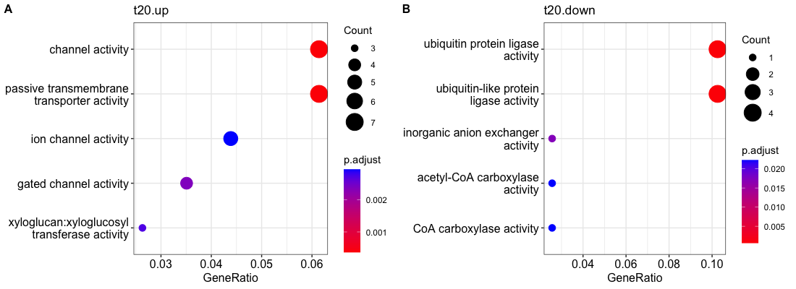
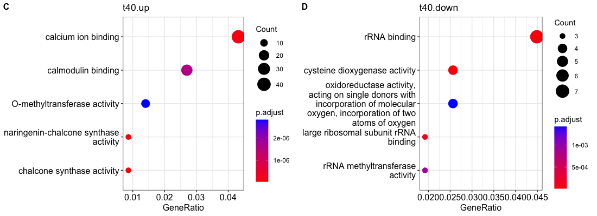
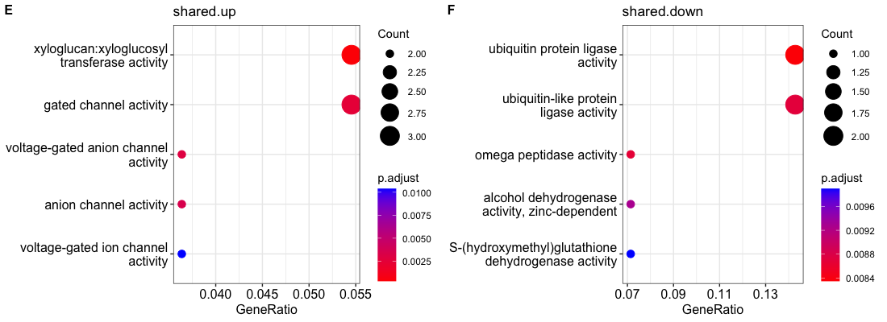

# Example of Gene Summary

```{r, message=F, warning=F}
#install via CRAN
#install.packages("rentrez")

# Function
geneSummary <- function(x){
  library(rentrez)

  # searches through NCBI gene db
  r_search <- entrez_search(db="gene", term=x) 
  
  # takes the UID of the first search input
  summ <- entrez_summary(db='gene', id=r_search$ids[1])
}


#example gene name
gene <- 'LOC100800175' 

# Get Summary of Gene 
summ <- geneSummary(gene)

# Description
summ$description
```

```{r}
# GLYMA name
summ$otheraliases
```

```{r, eval=F, include=T}
# Reading in the CSV file
csv <- read.csv('data/FPKM_tables/FPKM_full-table.csv', header=T)
df <- data.frame()

# Create a list of gene names from gene_name column
gene_list <- csv$gene_name

# Looping through each name in the gene list and creating a new dataframe
for(gene in gene_list){
  if(gene == '.'){
    temp <- data.frame('gene_name' = gene, 'alias' = NA, 'desc' = NA)
  }else{
    summ <- geneSummary(gene)
    temp <- data.frame('gene_name' = gene, 'alias' = summ$otheraliases, 'desc' = summ$description)
    }
  df <- rbind(df, temp)
}

# Create CSV file of annotations
# write.csv(df, '2022Dec21_GlymaAnnotations.csv')
```

## Annotating Data Subsets

-   **Location:** data/FPKM_tables/\*.csv

| Group | Expression Level | CSV File                              |
|-------|------------------|---------------------------------------|
| t20   | up               | \`FPKM_t20_up_1.5\`                   |
| t20   | down             | \`FPKM_t20_down_1.5\`                 |
| t40   | up               | \`FPKM_t40_up_1.5\`                   |
| t40   | down             | \`FPKM_t40_down_1.5\`                 |
| both  | up               | \`FPKM_t20_t40_up_1.5\`               |
| both  | down             | \`FPKM_t20_t40_down_1.5\`             |
| all   | all              | \`FPKM_average+1_fold_change_pvalue\` |

```{r}
# Source Rscript with Functions

source('ncbi-ann-glyma.R')

```

```{r, eval=F, include=T}
# Converting excel files to csv
library(readxl)

# Create a vector of Excel files to read
files.to.read <- list.files(path = './data/FPKM_tables/', pattern='xlsx')

# Read each file and write it to csv
lapply(files.to.read, function(f) {
  f <- paste0('./data/FPKM_tables/', f)
  df = read_excel(f, sheet=1)
  write.csv(df, gsub("xlsx", "csv", f), row.names=FALSE)
})

lapply(paste0('./data/FPKM_tables/', files.to.read), file.remove)
```

```{r, eval=F, include=T}
# reading in the files into separate variables
t20.up <- read.csv('data/FPKM_tables/FPKM_t20_up_1.5.csv', header=T)
t20.down <- read.csv('data/FPKM_tables/FPKM_t20_down_1.5.csv', header=T)
t40.up <- read.csv('data/FPKM_tables/FPKM_t40_up_corrected_2023_Jan13.csv', header=T)
t40.down <- read.csv('data/FPKM_tables/FPKM_t40_down_corrected_2023_Jan13.csv', header=T)
shared.up <- read.csv('data/FPKM_tables/FPKM_SHARED_t20t40_up_corrected_2023_Jan13.csv', header=T)
shared.down <- read.csv('data/FPKM_tables/FPKM_SHARED_t20t40_down_corrected_2023_Jan13.csv', header=T)
```

```{r, eval=F, include=T}
# building data.frame t_id, gene_id, gene_name, group, expression.level
# annotate(data, csv_output_name)
t20.up.df <- annotate(t20.up, 'data/Annotations/t20.up_annotations.csv')
t20.down.df <- annotate(t20.down, 'data/Annotations/t20.down_annotations.csv')
t40.up.df <- annotate(t40.up, 'data/Annotations/t40.up_annotations.csv')
t40.down.df <- annotate(t40.down, 'data/Annotations/t40.down_annotations.csv')
shared.up.df <- annotate(shared.up, 'data/Annotations/shared.up_annotations.csv')
shared.down.df <- annotate(shared.down, 'data/Annotations/shared.down_annotations.csv')
```

```{r, message=F, warning=F, include=F, eval=F}
# Reading in from CSV to avoid redoing 
# lengthy annotate() function
t20.up.df <- read.csv('data/Annotations/t20.up_annotations.csv', header=T)
t20.down.df <- read.csv('data/Annotations/t20.down_annotations.csv', header=T)
t40.up.df <- read.csv('data/Annotations/t40.up_annotations.csv', header=T)
t40.down.df <- read.csv('data/Annotations/t40.down_annotations.csv', header=T)
shared.up.df <- read.csv('data/Annotations/shared.up_annotations.csv', header=T)
shared.down.df <- read.csv('data/Annotations/shared.down_annotations.csv', header=T)
```

```{r, include=T, eval=F}
# Adding identifers to each dataframe
library(dplyr)
t20.up.df <- t20.up.df %>% 
  mutate(id = t20.up$t_id, 
         gene_id = t20.up$gene_id, 
         group = 't20', expression = 'up')
t20.down.df <- t20.down.df %>% 
  mutate(id = t20.down$t_id, 
         gene_id = t20.down$gene_id,
         group = 't20', expression = 'down')
t40.up.df <- t40.up.df %>% 
  mutate(id = t40.up$t_id, 
         gene_id = t40.up$gene_id,
         group = 't40', expression = 'up')
t40.down.df <- t40.down.df %>% 
  mutate(id = t40.down$t_id, 
         gene_id = t40.down$gene_id,
         group = 't40', expression = 'down')
shared.up.df <- shared.up.df %>% 
  mutate(id = shared.up$t_id, 
         gene_id = shared.up$gene_id,
         group = 'shared', expression = 'up')
shared.down.df <- shared.down.df %>% 
  mutate(id = shared.down$t_id,
         gene_id = shared.down$gene_id,
         group = 'shared', expression = 'down')

```

```{r, include=F, eval=F}
# combine all vectors into one df
full.ann <- rbind(t20.up.df, t20.down.df, t40.up.df, t40.down.df, shared.up.df, shared.down.df)
full.ann <- full.ann %>% dplyr::select(id, group, expression, uid, gene_id, gene_name, alias, desc)

# write.csv(full.ann, 'data/Annotations/Full_DEG_Annotations.csv', row.names=F)
```

```{r View dataframe}
# Original Dataframe
head(t20.up, 5)

# Example of New Annotation
head(t20.up.df, 5)
```

## GO-term Enrichment

```{r Add GO Annotations to NCBI Gene Annotation DF, message=F, warning=F, include=T, eval=F}
orgdb <- glycine.db()

# Combining annotations with GO terms
# And writing csv files for each. 

df.list <- list(t20.up.df, 
             t20.down.df, 
             t40.up.df, 
             t40.down.df, 
             shared.up.df, 
             shared.down.df)

csv.list <- c('t20.up.GO.csv', 
              't20.down.GO.csv',
              't40.up.GO.csv',
              't40.down.GO.csv',
              'shared.up.GO.csv', 
              'shared.down.GO.csv')

for(i in 1:length(csv.list)){
  x <- df.list[i]
  csv <- paste0("data/Annotations/",csv.list[i])
  
  write.GO(x, csv, orgdb)
}
```

```{r}
# Example of combined annotations
head(as.data.frame(x), 5)
```

```{r Create CSV of annotations, include=T, eval=F}
# write combined 
# annotations into csv
new.df <- data.frame()
for(i in 1:length(csv.list)){
  csv <- paste0("data/Annotations/",csv.list[i])
  temp <- read.csv(csv, header=T)
  
  new.df <- rbind(new.df, temp)
}

write.csv(new.df, "data/Annotations/Full.GO.Annotations.csv")
```


```{r GO enrichment, include=T, eval=F}
# Getting GO terms using GO.profile function
g20.up <- GO.profile(t20.up, orgdb)
g20.down <- GO.profile(t20.down, orgdb)
g40.up <- GO.profile(t40.up, orgdb)
g40.down <- GO.profile(t40.down, orgdb)
gshared.up <- GO.profile(shared.up, orgdb)
gshared.down <- GO.profile(shared.down, orgdb)
```

```{r GO Enrichment Visuals, message=F, warning=F, include=T, eval=F}
# dotplot
library(enrichplot)

a <- dotplot(g20.up$ego, showCategory=5) + ggtitle('t20.up')
b <- dotplot(g20.down$ego, showCategory=5) + ggtitle('t20.down')
c <- dotplot(g40.up$ego, showCategory=5) + ggtitle('t40.up')
d <- dotplot(g40.down$ego, showCategory=5) + ggtitle('t40.down')
e <- dotplot(gshared.up$ego, showCategory=5) + ggtitle('shared.up')
f <- dotplot(gshared.down$ego, showCategory=5) + ggtitle('shared.down')

# Visualize images
library(cowplot)

plot_grid(a, b, labels = c('A', 'B'), label_size = 12) # 1100 x 400
plot_grid(c, d, labels = c('C', 'D'), label_size = 12)
plot_grid(e, f, labels = c('E', 'F'), label_size = 12)
```




